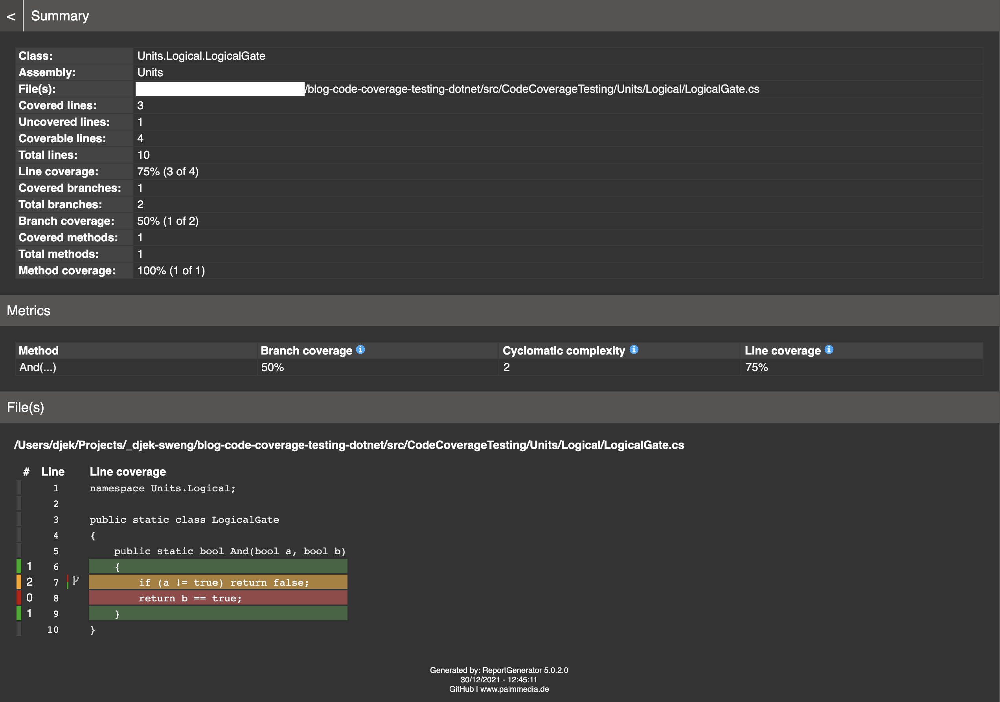

### Code coverage testing with .NET - your C# code under the magnifying glass
Testing is the middle name of every serious software developer. But there is still a bit more to it than standard testing with the [xUnit framework](https://xunit.net/). With additional analysis of the [code coverage](https://en.wikipedia.org/wiki/Code_coverage), you can raise the quality of your unit tests to a higher level. The effort is low, because .NET already has the necessary tools on board.

#### **Advantages**
You get a better feel for your coding because:
* You will find untested code.
* You will find unreachable (dead) code.
* You will identify missing (not implemented) functionality more easily.
* You will measure the complexity of your code.

#### **Create a test project**
The following code block shows how to create an xUnit test project and add the appropriate test data collector to your project. You also have to install a global report generator once.

```sh
# create test project
dotnet new xunit -n Units.Test
# add test data collector
cd Units.Test
dotnet add package coverlet.collector
# install global reportgenerator
dotnet tool install -g dotnet-reportgenerator-globaltool
```

#### **Implement tests**
You implement your tests using the well-known xUnit method. If you need initial help, you will find many examples on GitHub in the [xUnit repository](https://github.com/xunit/samples.xunit). For the first example test you write yourself an AND logic to be tested and save it in a separate .NET class library project.

```csharp
namespace Units.Logical;

public static class LogicalGate
{
    public static bool And(bool a, bool b)
    {
      if (a != true) return false;
      return b == true;
    }
}
```

Then you implement a first test case in the previously created test project. For the complete test of the AND logic, you can write three more test cases using the method shown above.

```csharp
using Units.Logical;
using Xunit;
 
namespace Units.Test.TestCases;

public class LogicalGateTest
{
    [Fact]
    public void Should_BeFalse()
    {
        Assert.False(LogicalGate.And(/*a*/ false, /*b*/ true));
    }
}
```

#### **Execute tests**
The following code block shows you how you can run your tests by script. You create a shell script for this in the project directory next to the * .csproj project file.

```sh
#!/bin/sh
dotnet test --collect:"XPlat Code Coverage"
```

You then start the script from your shell. Make sure to make your script executable beforehand.

```sh
./test_code_coverage.sh
```

After the test execution, your project directory could look like this.

```sh
.
├── TestCases
├── TestResults
│   └── 390ff9f7-6d5f-4d38-ab6b-84e74b5a3d76
│       └── coverage.cobertura.xml
├── Units.Test.csproj
└── test_code_coverage.sh
```

#### **Generate test report**
How to generate a report from the collected test data can be seen in the following code block. The best thing to do is to write a short shell script here as well.

```sh
#!/bin/sh
GUID="$1"
EXPORT_DIR="./TestResults/${GUID}"

reportgenerator "-reports:${EXPORT_DIR}/coverage.cobertura.xml" "-targetdir:${EXPORT_DIR}/coveragereport" -reporttypes:Html
```

You then start generating the report (including specifying the guide for the test data) as follows.

```sh
./test_report.sh 390ff9f7-6d5f-4d38-ab6b-84e74b5a3d76
```

After the test execution and report generation, your project directory could look like this.

```sh
.
├── TestCases
├── TestResults
│   └── 390ff9f7-6d5f-4d38-ab6b-84e74b5a3d76
│       ├── coverage.cobertura.xml
│       └── coveragereport
├── Units.Test.csproj
├── test_code_coverage.sh
└── test_report.sh
```

In the coveragereport directory you will now find an HTML report that you can open via your browser.

#### **Analyze tests**
The test report provides you with information on the [coverage](https://en.wikipedia.org/wiki/Code_coverage) and [cyclomatic complexity](https://en.wikipedia.org/wiki/Cyclomatic_complexity) (McCabe metric) of your tested code. You can use groupings and filters to analyze your code from the namespace level down to the method level. Here you can get a first look at the test report for the example discussed.



With the test case shown, you will achieve a line coverage of 75% and a branch coverage of 50%. All green lines and branches are completely covered by your testing. The yellow and red lines or branches, on the other hand, have only been tested partially or not at all, you can still improve here. According to McCabe, your code has a low cyclomatic complexity of 2 and is harmless.

As already mentioned above, you could achieve coverage of 100% line and branch coverage through further targeted test cases. Just give it a try!

#### **Conclusion**
Hopefully this simple example will show you what additional analysis options code coverage testing can offer you. It is of course now up to you to decide what code coverage is required for your testing. Once you have made your first experiences, it is best to define a sufficient end criterion for your code coverage tests in advance.

You can find the complete code in this GitHub repository.

Happy Testing!

#### **German version**

https://www.traperto.com/code-coverage-testing-mit-dotnet-dein-csharp-code-unter-der-lupe/
